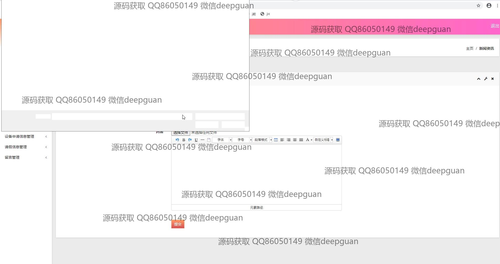

<h1 align="center">疫情居家办公OA系统</h1>

## 简介
疫情居家办公OA系统：涵盖员工信息管理、考勤管理、请假审批、设备管理、消息发布及留言板功能，支持居家办公高效管理与操作，优化员工数据和设备资源分配。    --计算机毕业设计源码；毕设源码；java毕业设计源码

## 联系方式

<h3 align="center">获取完整代码与数据库文件 + 微信：deepguan QQ: 86050149 QQ群: 783742310</h3>

<h3 align="center">可帮忙远程部署 包运行成功！提供远程部署、修改代码、设计文档指导、代码讲解等服务！</h3>

## 功能介绍（完整见运行截图）
管理员：管理员可以登录系统，访问后台管理模块，查看和编辑员工信息，管理考勤记录，以及办公设备的申请与调配。管理员还可以审批员工的请假申请，管理和回复留言，编辑新闻栏目，并有权限进行系统设置和维护操作，如修改用户密码、更新或调整功能模块。

员工：员工角色可以进行系统登录和信息管理，包括查看和修改个人资料，提交考勤记录和请假申请。员工可以在系统中申请办公设备，上传和编辑个人文件，并通过内部留言板功能进行信息交流。此外，员工能够查看新闻栏目和公司公告，并参与到办公设备管理与使用的资源调配中。

## 运行截图

本代码来源于网络,仅供学习参考使用!

